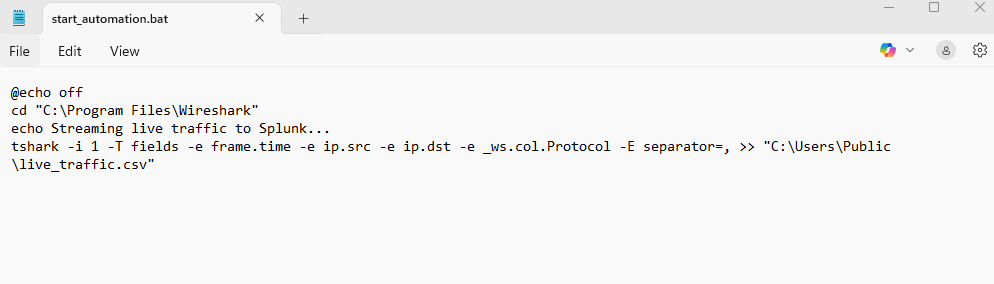
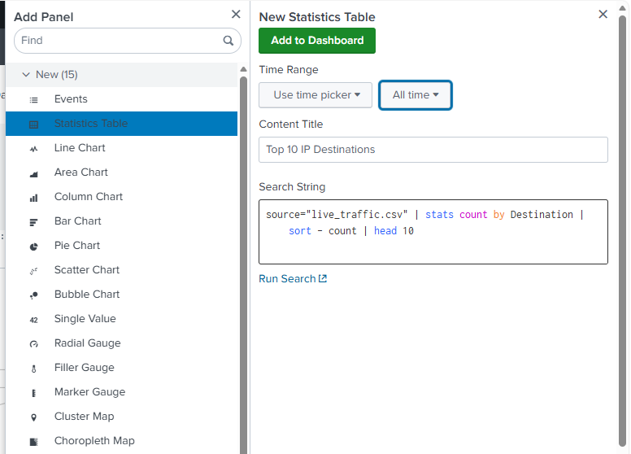

# 🛡️ Real-Time Network Traffic Analysis & SIEM Dashboard

## 📌 Project Overview
This project demonstrates a fully automated **Security Information and Event Management (SIEM)** pipeline. Unlike static PCAP analysis, this lab captures **live network traffic** using **TShark**, automates data extraction via batch scripting, and streams it into **Splunk Enterprise** for real-time monitoring and proactive threat detection.

> [!IMPORTANT]
> **Real-Time Capabilities:** This system is designed to detect anomalies like DoS spikes as they happen, providing a proactive security posture.

---

## 🛠️ Tools & Technologies
* **TShark (Wireshark CLI):** Used for low-resource, continuous packet sniffing.
* **Windows Batch Scripting:** Created `start_automation.bat` to automate the capture process.
* **Splunk Enterprise:** Used for real-time data ingestion, SPL querying, and SOC dashboarding.
* **Wireshark (GUI):** Used for initial protocol baselining and I/O graph analysis.

---

## 🚀 Step-by-Step Implementation

### 1. Network Baselining
Before automating, I analyzed the network's protocol hierarchy and traffic load using Wireshark's I/O graphs to establish a baseline.

### 2. Automated Live Capture
I developed a custom Batch script to trigger **TShark**. It extracts fields such as Source/Destination IP, Protocol, and Length, saving them directly into a live-updating CSV file.

### 3. Splunk Ingestion & Field Extraction
The live CSV was indexed into Splunk. Using the **Field Extractor**, I normalized the raw data into searchable fields, ensuring high data quality for the SOC dashboard.

---

## 🖼️ FINAL SOC DASHBOARD
The final dashboard provides a real-time overview of the network traffic, protocol distribution, and top talkers.

---

## 💡 SECURITY INSIGHTS & ALERTING

### 🚨 **REAL-TIME THREAT DETECTION**
I implemented a **Custom Security Alert** named "Possible DoS Attack Detected" to identify traffic spikes. The system triggers an alert if the packet count exceeds the defined safety threshold.

---

## ⚙️ **HOW TO RUN THE LAB**

Follow these steps to replicate this environment:

### **Step 1: Setup Data Capture**
1. Download the `start_automation.bat` script.
2. Ensure **TShark** (Wireshark) is installed on your system.
3. Run the script as **Administrator** to start the live capture.
   

### **Step 2: Splunk Configuration**
1. Open Splunk and navigate to **Settings > Data Inputs > Files & Directories**.
2. Add the `live_traffic_final.csv` file created by the script.
3. Set the **Source Type** to `csv` and finalize the ingestion.

### **Step 3: Dashboard & Alerts**
1. Copy the SPL queries provided in the `scripts/` folder into Splunk Search.
2. Save the visualizations to a new **Dashboard**.
3. To enable the alert, save the query as an **Alert** and set it to **Real-time**.

---

## 📂 REPOSITORY STRUCTURE
* **screenshots/** - Step-by-step lab evidence and dashboard captures.
* **scripts/** - Contains `start_automation.bat` and SPL queries.
* **README.md** - Full project documentation.

---

**SUMMARY:** This project highlights my ability to build automated security pipelines and use industry-standard SIEM tools for proactive threat hunting.

**CREATED BY AMAL | Passionate about Cybersecurity & Security Operations.**
